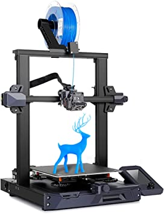
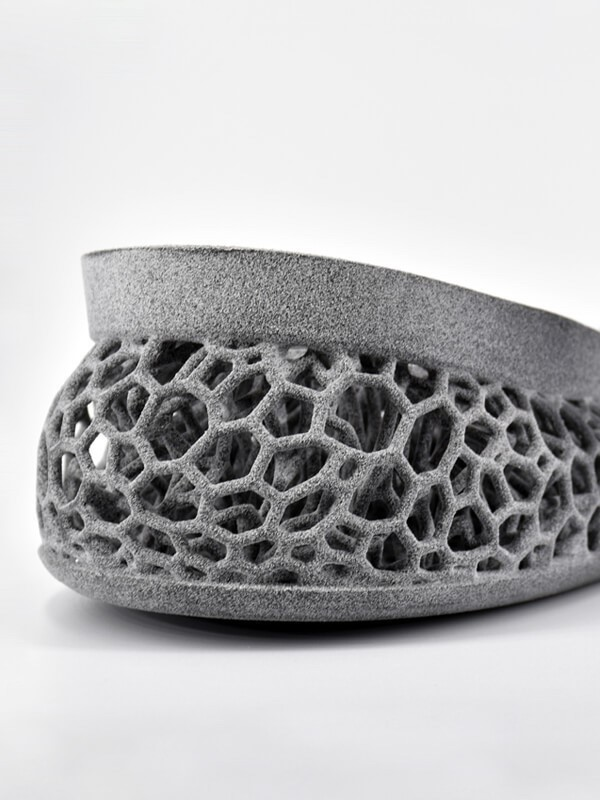
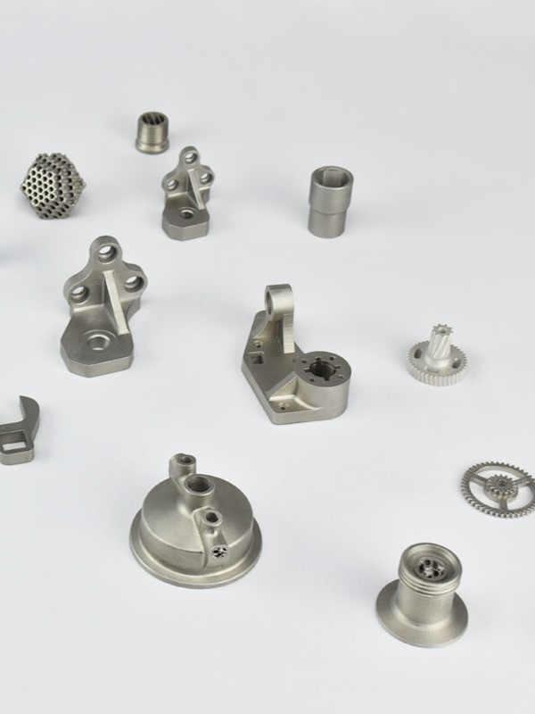
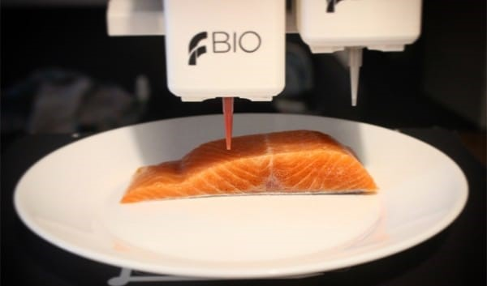

```{r setup, include=FALSE}
knitr::opts_chunk$set(echo = FALSE)
```

```{r, fig.cap="Imprimante 3D", out.width="50%", fig.align='center'}

```

## Introduction

L'impression 3D est une technologie de production de formes tridimensionnelles à partir de données numériques. Cela permet aux utilisateurs de concevoir et de produire des objets physiques en utilisant un ordinateur et une imprimante 3D.
Le processus d'impression 3D a été développé dans les années 1980 et était à l'origine connu sous le nom de "prototypage rapide". Cela a permis aux entreprises de développer des prototypes plus précisément que d'autres méthodes [@roberson_quest-ce_2022]. L'impression 3D a révolutionné la façon dont les produits sont connus, développés et produits, en permettant une plus grande flexibilité, une réduction des coûts et un temps de développement plus rapide. Après plus de 30 ans d'innovation, ses applications sont aujourd'hui encore plus diversifiées.
Les fabricants, les ingénieurs, les concepteurs, les enseignants, les médecins et les amateurs utilisent cette technologie pour une variété d'applications. 


## Type d'imprimerie 3D

Il n’existe pas une seule et unique façon d’imprimer en 3D, il en existe trois grands types : plastique, métal et résine. Parmi ces types, il y a plusieurs techniques utilisées qui allient différents matériaux et technologies pour créer un produit final stable. Selon la nature et l’utilisation du projet, des propriétés dont on a besoin, par exemple de la résistance ou de la durabilité, le choix se portera sur la technologie la plus adaptée.


### Impression 3D de plastique :
```{r, fig.cap="Impression plastique", out.width="30%", fig.align='center'}

```
•	Le Frittage Sélectif par Laser, ou SLS : cette technique d'impression 3D crée des objets en frittant des poudres au laser dans une imprimante. Au cours du processus couche par couche, le lit de poudre est préchauffé et le laser fritte la poudre en un objet solide selon le fichier 3D.

•	Dépôt de fil ou FDM:  Ce procédé d'impression 3D est familier non seulement aux amateurs, mais aussi à la communauté éducative. La matière plastique se présente sous forme de filaments. Les imprimantes 3D FDM utilisent une ou deux têtes d'impression pour le dépôt par fusion. Faites fondre le filament et extrudez-le à travers la buse d'impression pour créer l'objet souhaité couche par couche. L'impression FDM est principalement connue comme un processus d'impression 3D pour les plastiques, mais elle peut désormais également être utilisée pour imprimer des métaux et plus encore. [@sculpteo_quest-ce_2022]


### Impression 3D de résine :
• CLIP ou DLS : La technologie DLS fonctionne en projetant une série d'images UV générées par un projecteur de lumière numérique à travers un verre transparent aux UV derrière une cuve de résine. Une zone morte créée sur le verre maintient l'interface liquide derrière la pièce. Les pièces durcies sont retirées du bain de résine au-dessus de la zone morte. 

• Polyjet : Cette technologie d'impression 3D à base de résine projette une couche de liquide photopolymère durcissable sur le lit d'impression. Le logiciel calcule le placement du photopolymère et du matériau de support pendant l'étape de prétraitement. Lors de l'impression, les imprimantes 3D à résine projettent de minuscules gouttelettes de photopolymère liquide qui durcissent instantanément avec la lumière UV.

• Stéréolithographie ou SLA : La stéréolithographie a été la première technologie d'impression 3D développée. La technologie SLA est un processus d'impression 3D qui utilise un réservoir rempli de résine liquide qui durcit avec la lumière UV. Les objets peuvent être imprimés en 3D en les déplaçant de bas en haut (ou vice versa) pour faire de la place au polymère non solidifié au fond du réservoir. [@sculpteo_quest-ce_2022]

```{r, fig.cap="Impression résine", out.width="30%", fig.align='center'}
knitr::include_graphics("resine.jpg")
```

### Impression 3D de métal :

```{r, fig.cap="Impression métal", out.width="50%", fig.align='center'}
knitr::include_graphics("metal2.jpg")
```

• Frittage laser direct de métal, ou DMLS : ces imprimantes 3D complètent les pièces en frittant de fines poudres métalliques. Le processus est assez similaire à celui utilisé pour le frittage sélectif par laser des plastiques. La différence est la température de frittage, qui est beaucoup plus élevée pour les techniques d'impression sur métal. En effet, les polyamides doivent être frittés entre 160°C et 200°C, tandis que les métaux fondent à des températures comprises entre 1510°C et 1600°C. 

• Selective Laser Melting, ou SLM : Contrairement à la technologie DMLS, le SLM fait fondre complètement la poudre et doit donc atteindre des températures beaucoup plus élevées. De plus, le processus d'impression reste le même, un laser frittant la poudre pour créer un objet solide, couche par couche. 

• Binder Jetting : Cette méthode de fabrication additive permet de créer des pièces métalliques par fabrication additive. Le spray adhésif utilise un liant, qui est déposé sur une poudre basée sur un modèle 3D. La poudre est ensuite traitée et solidifiée couche par couche. Une fois le processus terminé, la boîte de construction sera retirée de l'imprimante 3D et placée dans le four. Après cette étape, les pièces peuvent être séparées et la poudre retirée à l'aide d'un pinceau et d'un souffleur d'air. [@sculpteo_quest-ce_2022]

```{r, fig.cap="Impression métal", out.width="30%", fig.align='center'}

```

### Impression 3D de couleur :
• Colorjet : Cette technologie crée des pièces multicolores. Comme pour tout processus d'impression, les pièces sont créées couche par couche. Deux têtes d'impression se déplacent sur le lit de poudre, déposant simultanément de la peinture sur le substrat. [@sculpteo_quest-ce_2022]


## Domaines et secteurs d'application

L'impression 3D est utilisée dans un large éventail de domaines, tels que :

1.	Secteur industriel : pour la production de pièces de rechange, de moules et de prototypes.

2.	Secteur médical : pour la production d'implants personnalisés, de prothèses et d'outils chirurgicaux.

3.	Secteur aérospatial : pour la production de pièces légères pour les véhicules spatiaux.

4.	Secteur automobile : pour la production de pièces de voitures, de prototypes et de maquettes.

5.	Design et architecture : pour la création de maquettes et de prototypes de produits et de bâtiments.

6.	Éducation : pour aider les étudiants à comprendre les concepts en produisant des objets concrets.

7.	Décoration et artisanat : pour la production de bijoux, de décorations pour la maison et d'objets artisanaux uniques.

8.	Secteur militaire : pour la production de pièces de rechange pour les armements et les équipements.
Cette liste n'est pas exhaustive et l'impression 3D est en constante évolution, de nouveaux domaines d'application sont constamment découverts.


## Limites
 
L'impression 3D est une technologie en constante évolution, mais il y a encore certaines limites à surmonter :

1.	Coût élevé : Les imprimantes 3D haut de gamme peuvent coûter des milliers de dollars, ce qui peut les rendre inaccessibles pour les petites entreprises ou les particuliers.

2.	Qualité de l'impression limitée : La qualité de l'impression dépend de nombreux facteurs, tels que la qualité de l'imprimante, les paramètres d'impression et le matériau utilisé. Il peut être difficile d'obtenir une qualité d'impression élevée pour certains types d'objets.

3.	Temps d'impression lent : L'impression de gros objets peut prendre plusieurs heures, voire plusieurs jours.

4.	Choix limité de matériaux : Il y a actuellement un choix limité de matériaux disponibles pour l'impression 3D, ce qui peut limiter les applications pour certains produits.

5.	Problèmes de durabilité : Certains objets imprimés en 3D peuvent être plus fragiles ou moins durables que leurs homologues fabriqués de manière traditionnelle.

6.	Précision limitée : La précision de l'impression dépend de nombreux facteurs, tels que la qualité de l'imprimante et les paramètres d'impression. Il peut être difficile d'obtenir une précision élevée pour certains types d'objets.

Bien que ces limites existent, l'impression 3D continue de se développer rapidement et de nombreux défis peuvent être surmontés grâce à de nouvelles avancées technologiques.


## Evolution : Vers l'infini et au-dela

L'expression "l'infini et l'au-delà" fait référence à l'idée que les possibilités de l'impression 3D sont illimitées et peuvent aller au-delà de ce qui est actuellement connu et possible.
L'impression 3D peut ouvrir la voie à de nouvelles applications dans de nombreux domaines, tels que la médecine (par exemple, la production d'organes artificiels), l'aérospatial (par exemple, la production de pièces légères pour les véhicules spatiaux), la construction (par exemple, la production de bâtiments entièrement imprimés en 3D) et bien d'autres.
De plus, l'impression 3D peut également aider à résoudre des défis complexes, tels que la production de pièces en série à faible coût et à faible impact environnemental, la production de produits personnalisés en temps réel pour répondre aux besoins individuels et bien d'autres.

On prend l'exemple de l'impression 3D de nourriture. Les imprimantes alimentaires 3D utilisent des matériaux alimentaires, tels que la pâte à pizza, la pâte à biscuits, la pâte à sucre, etc., pour produire des aliments en forme de structure tridimensionnelle.
L'impression 3D de nourriture peut offrir de nombreux avantages, tels que la personnalisation des aliments en fonction des besoins alimentaires individuels, la création de nouvelles formes d'aliments pour une expérience de dégustation unique et la production de portions précises pour une alimentation contrôlée en termes de portion et de nutriments.
Ci-dessous, on peut voir un saumon imprimé en 3D, réalisé par une équipe d’étudiants danois. Ils ont développé un projet baptisé Legendary Vish ayant pour objectif de proposer une alternative vegan au saumon en Europe. Le but étant de reproduire texture, aspect et surtout les qualités nutritionnelles du saumon. [@moussion_legendary_2020]

```{r Saumon, echo=FALSE, fig.align='center', fig.cap="Impression filet de saumon", out.width="60%"}

```


Les avancées technologiques continuent de rendre l'impression 3D plus accessible et abordable pour un plus grand nombre de personnes, ce qui peut conduire à une nouvelle ère de la créativité et de l'innovation.


## Bibliographie

