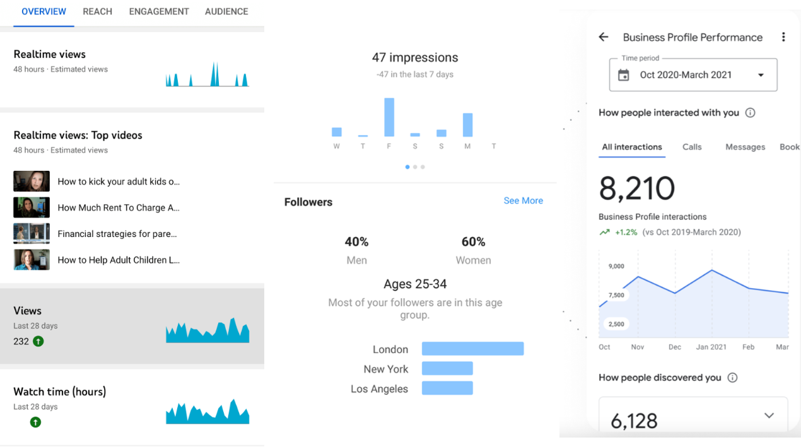
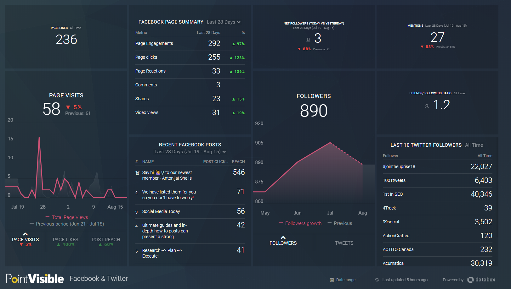

```{r setup, include=FALSE}
knitr::opts_chunk$set(echo=FALSE, message=FALSE, warning=FALSE)

setwd(dirname(rstudioapi::getSourceEditorContext()$path))
langData <- read.table("langagesPour.csv", header=TRUE, sep=";", dec=",", encoding="UTF-8")
langData$langages <- factor(langData$langages, levels=c("JavaScript", "R", "Python"))
langData$frequence <- factor(langData$frequence, levels=c("Jamais", "Rarement", "Parfois", "Souvent", "Toujours"))

library(tidyverse)
```

|       Dans le cadre de la première semaine de cours du module Open, plusieurs cours dispensés tout au long de celle-ci nous ont présenté ou réintroduit certains outils et langages, il s’agit en l’occurrence de Python, R Markdown, Shiny et Git/GitHub. À l’occasion de l’étude approfondie de ces outils, plusieurs possibilités s’offrent à chacun pour répondre à la question « Quelle application pouvons-nous faire de ces outils dans la vie professionnelle de chacun ? » Mais avant d’y répondre, remettons un peu de contexte sur la place des données dans le monde du travail.

# I. Une apparition de plus en plus marquée au quotidien

|       Aujourd’hui de plus en plus d’entreprises engagent des data analystes pour étudier les données en lien avec leur activité, observer des tendances de marché, des évolutions économiques au sens global, mais aussi des évolutions démographiques, environnementales et sociales. On retrouve ce domaine dans une multitude de secteurs, l’agroalimentaire, l’armement, l’ingénierie, la politique. À l’heure actuelle, ce domaine a sa place autant dans un bureau de conseil agricole, que dans une banque ou dans une campagne politique.

Des géants du numérique se sont dès lors mis à proposer des services pour les étudier, on peut citer par exemple l’outil *Google My Business* qui permet de suivre la présence en ligne d’une activité de freelance comme d’une grande entreprise. Ces géants se sont attelés à la rendre l’analyse de données plus ou moins ludiques, avec des interfaces travaillés, ergonomiques, interactives et pédagogiques. Que ce soit pour suivre la visibilité de son activité professionnelle sur **Google**, ou le succès de son profil **Instagram**, ou encore d’observer l’évolution de ses vues sur ses vidéos **YouTube**, l’analyse de données et les disciplines qui y sont liés sont présents partout autour de nous.

```{r out.width="80%", fig.align="center", fig.cap="Exemple de dashboard accessibles à tous : Google (gauche), Instagram (centre) et YouTube (droite)"}

```

|       Si l’on reprend les outils évoqués plus tôt, un usage croisé de ces derniers permet la mise en place et le déploiement de plateformes en ligne interactives pouvant réunir des données et émettre des analyses, ces plateformes sont des Dashboard. Véritable outil d’aide à la décision, ils font maintenant intégralement part de l’arsenal des grandes entreprises pour évoluer sur le marché. L'utilisation des tableaux de bord informatisés dans les entreprises a considérablement évolué au fil des ans, passant d'outils simples de suivi de la performance à des plates-formes de prise de décision complexes intégrant l'intelligence artificielle et l'analyse de données avancée. Cette évolution a considérablement améliorée la capacité des entreprises à prendre des décisions informées en temps réel, ce qui a conduit à une plus grande efficacité, une meilleure productivité et une amélioration globale de la rentabilité.

Au début, les tableaux de bord étaient principalement utilisés pour suivre les indicateurs de performance clé, tels que les ventes, les coûts et les bénéfices. Cependant, à mesure que la technologie s'est développée, les tableaux de bord se sont transformés en plates-formes complexes offrant une vue en temps réel de tous les aspects de l'entreprise, depuis les finances et les opérations jusqu'à la qualité de la satisfaction des clients. Les entreprises peuvent désormais utiliser des tableaux de bord pour surveiller les tendances, identifier les opportunités et résoudre les problèmes en temps réel.

L'importance des tableaux de bord dans la prise de décision est en grande partie due à leur capacité à fournir une vue centralisée et consolidée de toutes les données importantes de l'entreprise. La société se base sur cette analyse et sur les informations recueillies pour prendre des décisions stratégiques et ainsi améliorer ses performances dans son secteur [@leydier_devenir_2021]. Cela permet aux responsables de prendre des décisions informées en ayant accès à toutes les informations pertinentes en un seul endroit. De plus, les tableaux de bord peuvent être personnalisés pour répondre aux besoins spécifiques de chaque entreprise, ce qui garantit que les informations les plus importantes sont toujours à portée de main.


```{r out.width="80%", fig.align="center", fig.cap="Design d'un dashboard professionnel utilisé pour étudier la présence en ligne d'une entreprise"}

```

En outre, les tableaux de bord peuvent être intégrés à d'autres systèmes, tels que les systèmes de gestion de la relation client et les systèmes de gestion de la chaîne d'approvisionnement, pour une meilleure visibilité et une prise de décision plus efficace. Les tableaux de bord peuvent également être utilisés pour surveiller les tendances en temps réel, en utilisant des algorithmes d'IA et d'analyse de données pour identifier les opportunités et les menaces en temps réel.

# II. Des langages diverses et variés

|       Chaque personne souhaitant entreprendre le développement d'une application gérant de la donnée, se voit de faire le choix entre une multitude de langages chacun ayant ses atouts et ses défauts et qui poussent à un éternel débat de celui à choisir en tant que débutant. Les langages R et Python font dès lors parmi des plus utilisés, et font figure de référence dans ce domaine. Cependant, chacun a leurs avantages, et en fonction des demandes actuelles, l'un prend le dessus grâce, par exemple, à la capacité de l'un à travailler avec des API, l'autre à gérer et éditer un type précis de base de données avec plus ou moins de facilité [@rakotomalala_place_2018].

```{r out.width="70%", fig.align="center", fig.cap="Boxplot de la distribution de la fréquence d'usage des trois langages principaux utilisés en data visualisation"}
ggplot(langData, aes(x=annee, y=valeur, fill=frequence, alpha=factor(annee))) +
    geom_bar(position="fill", stat="identity") +
    facet_grid(~langages) +
    theme_classic() +
    theme(panel.spacing.x = unit(1.1,"line"),
          panel.border = element_blank(),
          strip.background = element_blank()) +
    scale_y_continuous(expand = c(0,0), labels=scales::percent) +
    labs(title="",x="Langages", y = "Réponse") +
    scale_fill_manual(values=c("#bf004b", "#bb2980", "#a04eae", "#706ccd", "#0383db"), name="Fréquence") +
    scale_alpha_discrete(range=c(0.5, 0.75, 1), guide="none")
```

Normalement, on pourrait aisément venir à penser que ce choix se fait en fonction du type d'application que l'on souhaite créer, mais aujourd'hui, même avec un concept clair comme l'idée de développer un dashboard, la question du choix du langage reste ouverte. On peut par exemple privilégier un langage pour sa performance et sa facilité de maintien dans le cas d'une application très demandeuse en ressource comme un dashboard financier, ou alors préféré un langage avec beaucoup de package pour avoir une plateforme touche-à-tout.

# III. Exemple de création de Dashboard : Les applications web Shiny

|       L'utilisation d'applications Shiny pour la visualisation de données en entreprise s'impose parmi les solutions les plus pertinentes, en raison de leur capacité à offrir une interaction en temps réel et une visualisation personnalisée des données. Shiny est un cadre open source pour les applications web interactives basées sur R, qui permet aux utilisateurs de créer des applications et des visualisations de données en utilisant le langage R.

Les applications Shiny peuvent être utilisées pour afficher des données complexes d'une manière simple et intuitive telles que les données financières, les données de vente, les données de production et les données de satisfaction des clients. Les visualisations peuvent inclure une multitude de graphiques, des cartes, des tableaux de données, etc.

L'un des avantages les plus importants des applications Shiny est qu'elles permettent une interaction en temps réel avec les données. Les utilisateurs peuvent filtrer les données, zoomer sur des sections particulières, et explorer les données de différentes manières pour en découvrir de nouveaux insights. Cela peut aider les entreprises à prendre des décisions plus informées en leur permettant de mieux comprendre les tendances et les relations dans leurs données.
En plus de la visualisation de données, les applications Shiny peuvent également être utilisées pour automatiser certaines tâches fastidieuses, telles que la collecte de données, l'analyse et la présentation. Cela peut aider les entreprises à gagner du temps et à se concentrer sur des tâches plus importantes, plus en lien avec la stratégie.

Enfin, les applications Shiny sont très flexibles et peuvent être personnalisées pour répondre aux besoins uniques de chaque entreprise. Les développeurs peuvent utiliser des packages R pour ajouter de nouvelles fonctionnalités et personnaliser les visualisations en fonction des besoins de l'entreprise. Cela signifie que les applications Shiny peuvent grandir et évoluer avec les besoins de l'entreprise au fil du temps.

|       En conclusion, l'utilisation d'applications Shiny pour la visualisation de données en entreprise est un choix judicieux pour les entreprises qui cherchent à améliorer leur prise de décision en visualisant leurs données de manière intuitive. Les applications Shiny offrent une interactivité en temps réel, une visualisation personnalisée et une flexibilité pour répondre aux besoins changeants de l'entreprise.

# IV. Conclusion

|       Les dashboard marquent un vrai tournant dans la visualisation de données, et ce, depuis les années 2000. Le développement de plateformes faciles d'accès, aux interfaces ergonomiques à la pointe de discipline comme l'UI (User Interface) et l'UX (User Experience) ont permis à ces plateformes d'obtenir une certaine attractavité chez les professionnels comme chez les particuliers, en donnant l'opportunité à chacun de se sentir acteur du domaine qu'il étudie. Aujourd'hui, le domaine de la Data Visualisation est en plein essor, et est assez vaste pour qu'étudier ce thème sous une multitude d'angles différents, qu'ils soient les plus pertinents ou non, face à la tendance à laquelle celui-ci vient à être étudié, se dévoile comme un besoin nécessaire. C'est en développement ces compétences-ci qu'il est possible de les porter sur un autre package, une autre plateforme ou encore un autre langage, et ainsi de s'adapter aux besoins du marché est d'être capable, en tant qu'ingénieur et professionnel, de répondre à la demande en toute efficacité.

# V. Bibliographie